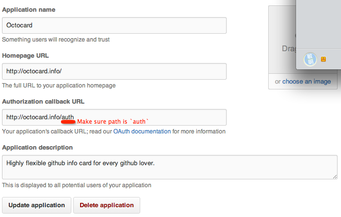

Octocard-server
===
Octocard-server is based on node and mongodb. It's used to build server for [Octocard](https://github.com/zmmbreeze/octocard).

How to build
---
1. Install [mongodb](http://www.mongodb.org/) and [node](http://nodejs.org/)
2. Create [github development application](https://github.com/settings/applications/) like this. Make sure to change the homepage url and callback url. 
3. `git clone https://github.com/zmmbreeze/octocard-server.git`
4. `cd octocard-server`
5. `npm install`
6. `cp config-sample.json config.json`
7. Put github Client ID and Client Secret into config.json.
8. `node app.js`
9. Open [http://localhost:8080/](http://localhost:8080/) in your favourite browser.
